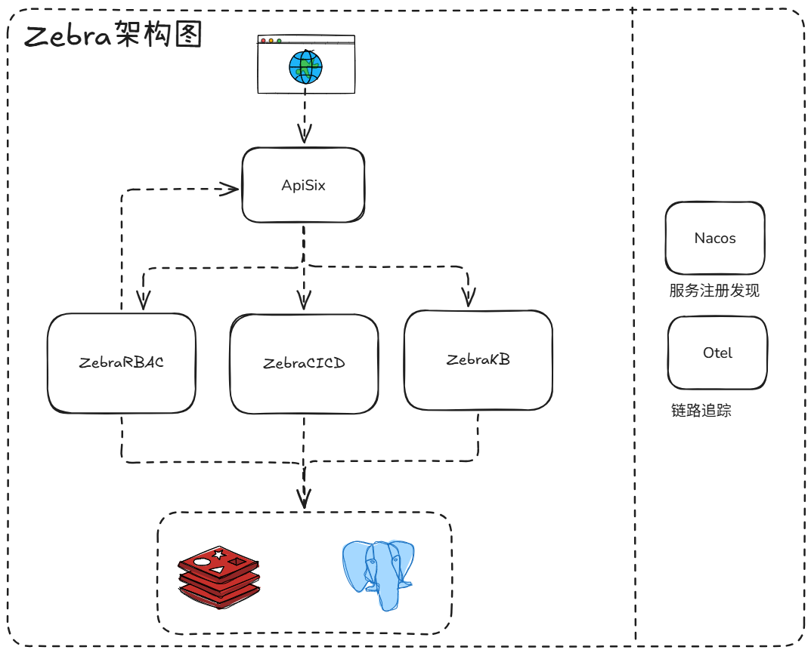

  <h1>Hi 👋, 我是橙子</h1>
  中文 | <a href="./README.en.md">English</a>
  <h3 align="center">一位专注于云原生、自动化和全栈实践的DevOps & SRE工程师</h3>

---
### 黑白分明，运维有道
- **黑白分明**：运维工作应该清晰明确，责任边界清晰，避免模糊地带
- **运维有道**：建立标准化、流程化的运维体系，让运维工作有章可循、有法可依

---

🔭 当前核心项目：我正在全力开源 斑马运维平台 ([Zebra Ops](https://github.com/ZebraOps)) —— 一个致力于提升运维效率和系统稳定性的现代化管理平台。

🌱 持续探索中：深入钻研 eBPF、OTel、Service Mesh 可观测性及 AIOps 的前沿实践。

👯 期待协作：寻找对运维工具、云原生中间件或开发运维一体化平台有同样热情的伙伴。

📫 如何联系我：iamnumachen@gmail.com

⚡ 个人标签：深信“懒惰”是工程师的美德，因此热衷于用自动化和智能系统解决一切重复劳动。

## 🛠️ 技术栈
### 前端技术
- 框架：Vue2 / Vue3 + Element UI / Ant Design Vue
- 状态管理：Pinia / Vuex
- 构建工具：Vite / Webpack

### 后端技术
- 语言：Go, Python, TypeScript
- 框架：Go-zero, Gin, FastAPI, Django, Flask
- 数据库：PostgreSQL, MySQL, Redis
- ORM：GORM, SQLAlchemy

### 云原生与基础设施
- 容器化：Docker, Kubernetes
- 服务网格：Istio, Linkerd
- 配置中心：Nacos, Apollo
- 监控告警：Prometheus, Grafana, Alertmanager
- 分布式追踪：OpenTelemetry, Jaeger

### 自动化与CI/CD
- 流水线：GitLab CI/CD, Jenkins, ArgoCD
- 编排：Ansible, Temporal
- 脚本语言：Python, Shell

### AI与智能化
- 大模型集成：LangChain、LangGraph
- AIOps：异常检测、根因分析

## 系统架构

### 架构说明
斑马运维平台采用微服务架构设计，核心组件包括：

- **Application Gateways**: 统一入口网关，负责请求路由、认证鉴权、限流熔断
- **Z-RBAC**: 权限管理服务，提供基于角色的访问控制（RBAC）功能
- **Z-CICD**: 持续集成与持续部署服务，支持自动化构建、测试、部署流程
- **Z-KB**: 知识库服务，存储运维知识、故障处理方案等
- **Nacos**: 服务注册与配置中心，实现服务发现和动态配置管理
- **Otel**: OpenTelemetry链路追踪，提供全链路监控能力
- **数据存储**: PostgreSQL（关系型数据）、Redis（缓存）、Elasticsearch（日志检索）

架构特点：
- 高可用：多节点部署，负载均衡
- 可扩展：模块化设计，支持水平扩展
- 易维护：统一监控告警，快速定位问题
- 安全可靠：完善的权限控制和审计机制

## 🎯 项目目标
打造一个现代化、智能化的运维管理平台，实现：
- 运维工作自动化，减少人工干预
- 系统状态可视化，提升可观测性
- 故障响应智能化，缩短MTTR
- 权限管理精细化，保障系统安全

## 🌟 核心特性
- 📊 实时监控大屏：多维度指标展示
- 🤖 智能告警：基于AI的异常检测
- 🔄 自动化运维：批量执行、定时任务、故障自愈
- 📚 知识沉淀：故障案例库、最佳实践
- 🚀 快速部署：Kubernetes、DockerCompose一键部署

## 开源项目
1. [ZebraUI](https://github.com/ZebraOps/ZebraUI) - 企业级运维管理平台。
2. [ZebraRBAC](https://github.com/ZebraOps/ZebraRBAC) - 基于 RBAC 的权限管理模块。
3. [ZebraCICD](https://github.com/ZebraOps/ZebraCICD) - 基于 Go 语言开发的持续集成与持续部署（CI/CD）的微服务。

## 🤝 贡献指南
- 提交Issue报告问题或提出需求
- 提交Pull Request贡献代码
- 参与文档编写和翻译
- 分享使用经验
- 和最佳实践

## 📞 联系方式
- 邮箱：iamnumachen@gmail.com
- GitHub：[ZebraOps](https://github.com/ZebraOps)
